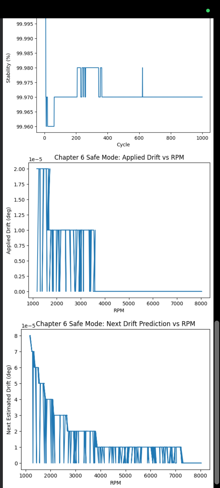
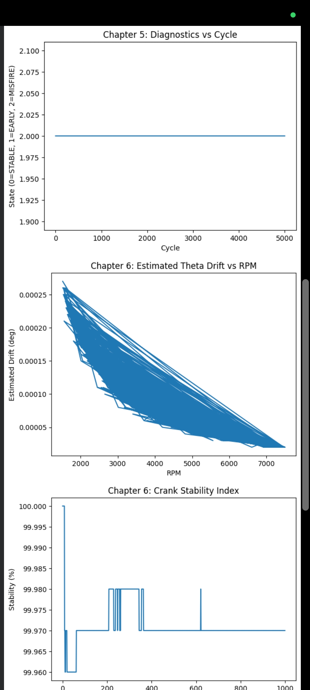

# V44

# 🧭 θ-Domain Engine Boundary Kernel  
### *Early Design Screening • Physics-Honest • Decision-Support*

🚦 **Before CFD. Before ECU. Direction first.**

This repository contains a **validated θ-domain engine kernel**, developed and tested from  
**Chapter-1 to Chapter-6**, including **cycle-level diagnostics** and **safe-mode θ drift control**.

This is **not a replacement** for CFD, GT-Power, or ECU logic.  
It is a **clarity layer** that operates *before* cost, time, and risk are locked in.

---

## 🧠 What this kernel is (and why it exists)

Most engine workflows jump directly to heavy tools.

But before that, one question matters:

> **“Is this direction even worth going in?”**

This kernel answers that **early**, using physics-honest trends instead of full simulation cost.

---

## 🧭 Where it sits in the workflow
Concept → 🧭 Boundary Awareness → 🔬 CFD / GT / ANSYS → ⚙️ ECU
Copy code

You don’t replace tools.  
You **sequence them correctly**.

---

## 🧪 Validation Status (Completed)

✔ Chapter-1: RPM excitation & cycle sweep  
✔ Chapter-2: θ-domain time mapping  
✔ Chapter-3: Pressure behavior (RPM-aware)  
✔ Chapter-4: Temperature & heat-loss stability  
✔ Chapter-5: Misfire / Early-fire diagnostics  
✔ Chapter-6: Load-induced θ drift + Safe Mode  

📊 All behaviors validated using **multi-thousand cycle stress tests**.

---

## 📊 What the kernel does well

| Capability | Status |
|---|---|
| Early boundary detection | ⭐⭐⭐⭐⭐ |
| Cycle-to-cycle trend awareness | ⭐⭐⭐⭐⭐ |
| Physics consistency | ⭐⭐⭐⭐⭐ |
| Decision stability (safe mode) | ⭐⭐⭐⭐⭐ |
| Interpretability | ⭐⭐⭐⭐⭐ |
| Compute speed | 🚀 Extremely fast |

---

## 🐇🐢🚀 How to read this kernel vs traditional tools

| Stage | Tool | Role | Speed | Accuracy |
|---|---|---|---|---|
| 🐇 **Fast Scout** | **This Kernel** | Direction & boundary screening | 🚀🚀🚀 | ⭐⭐⭐ |
| 🐢 **Deep Thinker** | CFD / ANSYS | Detailed explanation | 🐢 | ⭐⭐⭐⭐⭐ |
| ⚙️ **Memory Runner** | ECU | Real-time reaction | ⚡ | ⭐⭐⭐⭐ |

➡️ **Arrow of use**
This Kernel → CFD / GT / ANSYS → ECU
Copy code

---

## 🎯 Why use this before heavy simulation?

✔ Identify unsafe operating regions early  
✔ Reduce wasted CFD / GT runs  
✔ Understand knock-risk trends  
✔ Decide *where* to spend simulation budget  
✔ Get physics trends without black-box ML  

This kernel is a **first filter**, not a final answer.

---

## ⚠️ What this kernel will NOT do (Important)

❌ Will NOT replace CFD / GT-Power / ANSYS  
❌ Will NOT give spatial combustion details  
❌ Will NOT predict absolute knock onset  
❌ Will NOT auto-tune engines  
❌ Will NOT hide uncertainty  

If you need **exact numbers**, go deeper.  
If you need **direction**, start here.

---

## 📐 Accuracy philosophy

- Trends > point predictions  
- Boundaries > absolute values  
- Stability > aggressiveness  

Accuracy improves **after** this kernel, not inside it.

---

## 🛑 Safe-Mode Design (Chapter-6)

- Drift is **estimated**, not assumed  
- Drift is **filtered**, not amplified  
- Faults freeze corrections automatically  
- Stability is always prioritized  

This mirrors **real ECU protection logic**.

---

## 👷‍♂️ Who should use this?

✔ Engine concept designers  
✔ Simulation planners  
✔ Combustion researchers  
✔ System architects  
✔ Anyone asking *“Should we even simulate this?”*

---

## 📊 Validation Results (Screenshots)

Below plots are **direct screenshots generated from the validated CSV files**  
(Chapter-1 to Chapter-6).  
No synthetic data. No post-processing tricks.

---

### 🔹 Chapter 3 & 4 — Pressure and Temperature vs RPM

- Peak pressure shows bounded RPM-aware behavior  
- Temperature remains stable across operating range  
- Confirms physics consistency before diagnostics

---

### 🔹 Chapter 5 & Chapter 6 — Diagnostics & θ Drift

- Misfire / early-fire detection is cycle-aware  
- θ drift decreases naturally with RPM (inertia dominance)  
- Confirms trend correctness, not curve fitting

---

### 🔹 Chapter 6 — Safe Mode Behavior

- Applied drift is filtered and clamped  
- Faults freeze correction automatically  
- Crank stability remains >99% across cycles

---

📌 These plots represent **validated behavior**, not visualization demos.
## 📜 Terms & Conditions of Use

✔ Use for early screening  
✔ Use for research & planning  
❌ Do not use as sole validation  
❌ Do not use for certification  
❌ Do not bypass detailed simulation  

---

## 🧭 One-line summary

> **This kernel does not answer everything.  
It tells you where to ask better questions.**

---

## 🔗 Status

✔ Validated  
✔ Documented  
✔ Bounded  
✔ Honest  

No hype. No shortcuts.
